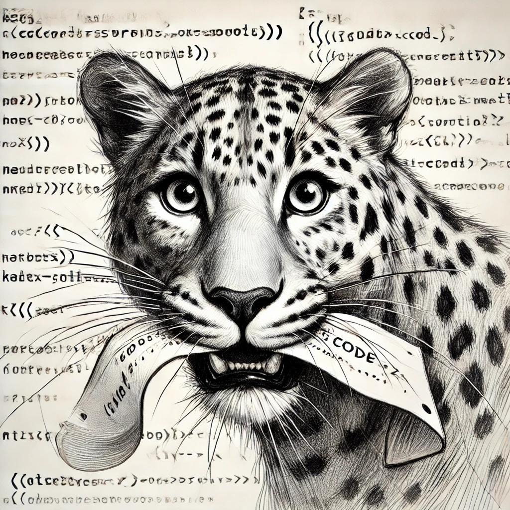

# LEOpARD-CC

LLM-Enabled Operations for Assured Refactoring to Decrease Cyclomatic Complexity



To install the required packages, run:

```
pip install -r requirements.txt
```

Then, clone the repositories for all projects using:

```
./clone_repos.sh
```

Then, you can run one specific case using:

```
python Script.py --project=<project_name> --prompt-strategy=<ChoiEtAl|Ours> --model=<model_name> [--reasoning-effort=<reasoning_effort>] [--iterations=<number,default:20>]
```

You can also run an experiment in a specific folder containing a experiment.yml file running the following:

```
python experiment_runner.py <experiment_folder>
```
